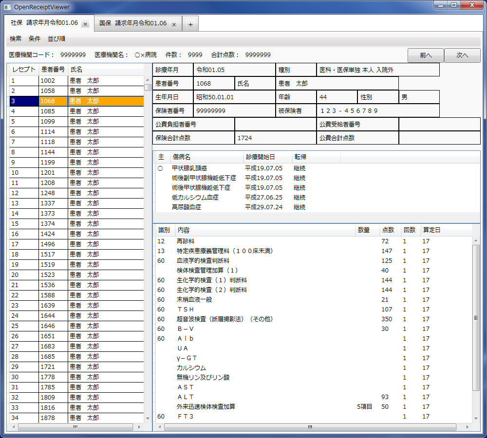

# OpenReceiptViewer

オープンソースのレセプトビューアー（レセ電ビューアー）です。
[GitHub](https://github.com/akihiro-yamashita/OpenReceiptViewer)に移行しました。

## セットアップ方法

[プロジェクトページ](https://github.com/akihiro-yamashita/OpenReceiptViewer)のファイル一覧から「OpenReceiptViewer.zip」を選び、  
「Download」ボタンをクリックして「OpenReceiptViewer.zip」をダウンロードします。  
このzipファイルを任意の場所で展開します。  
実行ファイルは「OpenReceiptViewer.exe」です。

## 使い方

「OpenReceiptViewer.exe」をダブルクリックし、  
タブ追加ボタン「＋」でレセプトファイル（.UKE拡張子）を選びます。  
またはタブ追加ボタン「＋」にレセプトファイルをドラッグアンドドロップします。

## マイメニュー機能（ベータ版）について

左側ペインのレセプト行選択で右クリックをすると「MyMenu.csv」で定義された自作のメニューを表示、実行させることができます。  
有効にするには「SampleMyMenu.csv」を元に「MyMenu.csv」を作成して下さい。  
レセプトファイルと同じくヘッダー行無しshift-jisのcsvファイルとなっていて、  
1列目がメニュータイトル、2列目が実行ファイルパス、3列目が起動引数です。  
3列目の起動引数にはカルテ番号や氏名を渡すことができます。  
「」と書いておけば、例えばカルテ番号が1111の行でマイメニュー実行時に「1111」を渡されます。  
これに関しても「SampleMyMenu.csv」を参考にして下さい。  

## システム要件

.NET Framework 4.8以上  
マルチプラットフォーム（特にmacOS）対応のため、技術選定中です。  
システム要件が変わると思います。  
~~.NET Framework 4以上（macOS対応のため、.NET6への移行を検討中）~~  

## ライセンス

Apache License, Version 2.0  
http://opensource.org/licenses/Apache-2.0

## 更新履歴

ver 0.2.1   医療機関コード表示のバグ修正  
ver 0.2.0   .NET Framework 4.8に移行  
ver 0.1.23   被保険者証の枝番表示、病棟コード表示対応  
ver 0.1.22   マスター更新  
ver 0.1.21   コメントパターン53、80、90に対応  
ver 0.1.20   2022年04月診療報酬改定対応マスター更新  
ver 0.1.19   マスター更新  
ver 0.1.18   2021年04月診療報酬改定対応、バージョン読み込みのバグ修正  
ver 0.1.17   レセプト行のマイメニュー機能追加  
ver 0.1.16   診療行為行や薬剤行内のコメント1～3表示対応  
ver 0.1.15   ゼロ埋めカルテ番号の検索対応  
ver 0.1.14   コメントマスター読み込みのバグ修正  
ver 0.1.13   コメントで条件をかけられる対応  
ver 0.1.12   コメントパターン50番等に対応改善  
ver 0.1.11   コメントパターン50番等に対応  
ver 0.1.10   患者フリガナ表示、レイアウト調整等  
ver 0.1.9    公費4レコードまで対応  
ver 0.1.8    日付の西暦表示対応  
ver 0.1.7    レセプトファイルのドラッグアンドドロップ対応改善  
ver 0.1.6    2020年04年診療報酬改定対応  
ver 0.1.5    レセプトファイルのドラッグアンドドロップ対応  
ver 0.1.4    数値以外カルテ番号対応等  
ver 0.1.3    高速化  
ver 0.1.2    複数タブ対応  
ver 0.1.1    令和対応  
ver 0.1.0    リリース  
